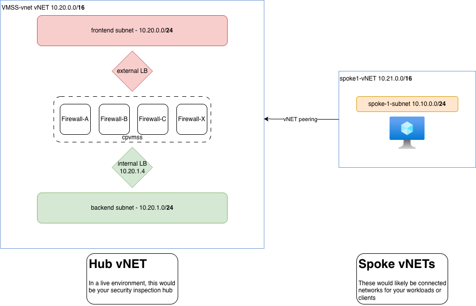

## CloudGuard Network Security (CGNS) Workshop
### Hands-on - Azure Scale Set (VMSS)


#### Modules:
1. Create the CloudGuard Scale Set (VMSS)
2. Configuring CME on the Smart Center Server
3. VMSS network configuration
4. Create Load Balancer rules to allow Web server connectivity 
5. Create a Policy to allow Web server connectivity
6. Optional Lab: Troubleshooting and Scaling Issues 
7. Optional Lab: Testing Scale-out


---

#### Lab Overview

In this lab, you will be deploying a CGNS Virtual Machine Scale Set (VMSS) inside a new vNet hub. If this is a Check Point led event, it will be continuiing in the sandbox environment you were provided credentials for.

**Lab Topology**


  
**Pre-requisites:**

- [Check Point Management station](./azure-management-lab.md)
- Azure Portal Access. 
- Windows PC with Smart Console and Putty client. This can be a VM in Azure / AWS if required.
- Windows PC must have unrestricted external access. A cloud-based VM will help here.

---

### Module 1 – Create the CloudGuard Scale Set

#### Step 1: Deploy the Scale Set

1.	Log in to the Azure Portal at https://portal.azure.com using the credentials provided.
2.	Select Create a resource. 
3.	In the search box enter Check Point and select the CloudGuard Network Security – Firewall & Threat  
4.	Then select from the dropdown list the CloudGuard Scale Set 
5.	Select Create
6.	Use the following to configure the Scale Set:


|**Selection**|**Choice**|**Notes**|
|---|---|---|
|Subscription|Choose a Subscription|Select the subscription to deploy under. In the lab, there is only one option|
|Resource Group|**Existing- ODL-<*>-<*>-03**|Used to identify resources of similar life-cycle|
|Region|East US (Or region of choice)|Choose a local region.<br><br>(West US 2, East US, Canada Central, Central US, South Central US)|
|Gateway scale set name|cpvmss|Your Scale set name. All lowercase, no spaces or special characters.|
|Authentication Type|**Default** (Password)||
|Password|Checkpoint123!|Unique password for Check Point.|
|Confirm Password|Checkpoint123!||

7.	Select Next: Check Point VMSS settings >


|**Selection**|**Choice**|**NOTES**|
|---|---|---|
|Management name|**CP-management**||
|Configuration template name|**Azure-Lab-Template**||
|Version|**R81.20/R82**|The version you want to deploy|
|License Type|**Bring your Own License**||
|Virtual Machine Size|**Default** (Standard D4ds v5)||
|SIC Key|Checkpoint123||
|Confirm SIC key|Checkpoint123||


8.	Select Next: CloudGuard Advanced Settings.


|**Selection**|**Choice**|
|---|---|
|Are you upgrading your CloudGuard VMSS solution?|**Default** (no)|
|Initial number of gateways|**Default** (2)|
|Maximum number of gateways|**None-Default** (4)|
|Administrator email address|**Leave Blank**|
|Load balancer deployments|**Default** (Standard)|
|External Load Balancer Session persistence|**Default** (None)|
|Internal Load Balancer Session persistence|**Default** (None)|
|Deploy the Load Balancer with floating IP|**Default** (No)|
|Deploy the VMSS with instance level Public IP address|**Yes**|
|Public IP prefix|**No**|
|Management interface and IP address|**Frontend NICs public IP address**|
|Number of Availability Zones|**Default** (None)|
|Enable CloudGuard metrics|**Default** (Yes)|
|Default shell for admin user|**/etc/clish** or **/bin/bash**|
|Maintenance Mode Hash|**Leave Blank**|
|Confirm Password|**Leave Blank**|
|Bootstrap script|Leave blank|
|Allow download from/upload to Check Point|**Default** (yes)|
|VM Disk type|**Default** (Premium)|
|Additional disk space|**Leave default**|

9.	Select Next: Network settings >
10.	In the Network settings, Edit Virtual Network
11.	In the VirtualNetwork, Select Edit virtual network
12.	Configure the VirtualNetwork as follows:

-	Name:			 VMSS-vnet
-	Network Range			10.20.0.0/16
  
-	Subnets. Confirm the Frontend and Backend subnet ranges fall in the same range as the Virtual Network.
    - VMSS-Frontend- 10.20.0.0/24
    - VMSS-Backend- 10.20.1.0/24


13.	In the Network Secure Groups select Create New and leave the name as the default
14.	Select Review + Create
15.	The Purchase Agreement will now appear. Approve the Terms and Select Create 


#### Step 2 (OPTIONAL): Assign Service Principal to VMSS Resource Group

***NOTE:***
In the lab's Azure bootcamp the Service Principal and secret are already created. The details are under the Bootcamp page under Service Principal. Please only follow these steps to review what is created or if you are running the instructions in your own environment.


1.	Create an Azure Service account. In Azure Portal go to the Azure Active Directory section on the left side
2.	Click the App registration, and then select New Registration.
3.	Provide the name as  <Your Name>-vmss
4.	Select the option for Accounts in this organizational directory only (<Account Name> - Single-tenant)
5.	Redirect URL set to Web  and  https://localhost/check-point-autoprovision
6.	Select Register
7.	Once registered this will bring you to the new APP overview page you just created.
Copy the Application (client) ID and Directory (tenant) ID key from this Overview page to your Notepad that you will use later.
8.	Select Certificates & Secrets and select the New Client secret.
9.	Fill in the following option for the client's secret
  - Description: Give a key description
  - Duration: Never expires
10.	Click Add 
11.	Copy the Key by the Value and paste it into your Notepad. This can’t be retrieved later.
12.	Now you need to find the Azure subscription. This can be found under the overview page of any Azure resources (You can also go to All services go under Subscriptions select the subscription and copy the subscription ID to your notepad that the VMSS resource will be deployed under.
13.	Attach the Application ID to the Azure Subscription by going under the Subscription selecting the subscription the VMSS service will be deployed under  and selecting Access Control (IAM)
14.	Click on the Add -> Add role assignment. 
15.	Select Reader and Next
16.	Select the Select Members 
17.	Past in the name of the app registration you created earlier

Example: &lt;your name&gt;-vmss 

18.	Select your App Registration
19.	Close and Select Next
20.	Select Review + assign

---

### Module  2 – Configuring CME on the Smart Center Server


1.	Log into Check Point Smart Console, create a Simple policy called Standard-vmss, with a single rule as Any, Any, Accept, Log rule, and publish the changes
2.	SSH into the Check Point Smart Center with the Putty client.
3.	Create the command to configure CME on the Smart Center:

Example:
```shell
autoprov-cfg init Azure -mn “<management-name>” -tn “<configuration-template-name>” -otp “<SIC-key>” -ver “R81.20/R82” -po “<policy-name>” -cn “<controller-name>” -sb “<azure-subscription>” -at “<active-directory-tenant-id>” -aci “<client-id>” -acs “<client-secret>”
```
Command explained:

|Items|Parameters|Example|
|---|---|---|
|`<management-name>`|Select a name you can identify. Could be any name you like.<br><br>**This is what was used using the VMSS Deployment**|CP-management|
|`<configuration-template-name>`|Give a name to represent this template. If you deploy other templates you will use another unique name<br><br>**This is what was used using the VMSS Deployment**|Azure-Lab-Template|
|`<SIC-key>`|One-time password for sic<br><br>**This is what was used using the VMSS Deployment**|Checkpoint123|
|-ver|VMSS version (R81.20/R82)<br><br>**The version of CheckPoint VMSS was used during the deployment**|R81.20/R82|
|`<policy-name>`|Name of you policy you will use<br><br>**The policy name that was created above**|Standard-vmss|
|`<controller-name>`|Name of your Azure connection. If you have multiple connections. This needs to be unique|Azure-Lab|
|`<azure-subscription>`|Your subscription ID from the above<br><br>**Copied in your notepad from earlier**|xxxxxxxxxxxxxxxx-xxxx-x|
|`<active-directory-tenant-id>` aka **Directory ID**|Your tenant ID from above<br><br>**Copied in your notepad from earlier**|xxxxxxxxxxxxxxxx-xxxx-x|
|`<client-id>`  <br>aka **Application ID**|Your client ID from above<br><br>**Copied in your notepad from earlier**|xxxxxxxxxxxxxxxx-xxxx-x|
|`<client-secret>`  <br>aka (Application **Key)**|Your client's secret from above<br><br>**Copied in your notepad from earlier**|*******|

Command example:

```bash
autoprov-cfg init Azure -mn "CP-managment" -tn "Azure-Lab-Template" -otp "Checkpoint123" -ver “R81.20” -po "Standard-vmss" -cn "Azure-Lab" -sb "da551519-1bd8-xxxxxxx-xxxxxxx " -at "c82f513e-c21f-4a87-xxxxxxx-xxxxxxx " -aci "e69452bc-4be8-xxxxxxx-xxxxxxx" -acs “YO9E2STVZfn+umgHwG9lYQnhuvDIixxxxxxxxxx=”
```

4.	On the Smart Center Putty session go into Expert mode:


```bash
cpmgmt> expert
Login with the admin password: Checkpoint123!
```

NOTE: You may need to set the expert password 

```bash
cpmgmt> set expert password
[you will be prompted to type and confirm your password]
[Expert@cpmgmt:0]save config
```

5.	Past the autoprov-cfg command into the Putty session
6.	Verify the command successfully communicates to Azure by running the command:

```service cme test```

This will test to ensure communication to the Cloud env (Azure) is working and proper permissions are provided. Ensure it comes back as All Tests passed successfully

7.	Run the following command to view the cme.log file and monitor if the VMSS gateways are detected and being deployed in the Smart Center:

```bash
[Expert@cpmgmt:0]tail -f /var/log/CPcme/cme.log
```

8.	In your Check Point Smart Console, watch/verify that the Gateways are added automatically and the Standard-VMSS policy is installed

---

### Module  3 – VMSS network configuration


By default, the template you deploy creates an external (Internet-facing) Load Balancer that:

Listens on TCP port 80 on the static public IP address of the external Load Balancer.
Forwards the traffic it receives to the pool of Check Point CloudGuard Security Gateways on TCP port 8081.

In this lab, we will continue to use the default assigned Public IP and TCP service. We configure the environment to properly load balance traffic behind a group of Web servers.

Steps:
1.	Add a new App subnet to the VMSS vNet
2.	Deploy two NGINX VMs in Azure in the App subnet
3.	Create a Web backend LB for the VM
4.	Configure Check Point policy 
5.	Test inbound connection.

**Step 1: Deploy an App vNets**

1.	Log in to the Azure Portal at https://portal.azure.com using the credentials provided.
2.	Select Create a resource. 
3.	In the search box enter Virtual Network and press Enter.
4.	Select the Virtual Network option.
5.	Select Create.
6.	Configure the Spoke vNet as follows:


|**Selection**|**Choice**|
|---|---|
|Subscription|**Leave default**|
|Resource Group:|**Use existing- ODL-<*>-<*>-05**|
|Virtual network name|**VMSS-App-vnet**|
|Region|**Choose the same Region as your VMSS is deployed under**|


7.	Select Next: IP Addresses.
8.	Configure the IP Address with the following:
- Delete the default IPv4 address space
- New address: 10.21.0.0/16

9.	Select add subnet.
10.	Use the following to create the new subnet.

- Subnet name: VMSS-App-subnet
- Subnet address range: 10.21.0.0/24

11.	Select Add.
12.	Select Review + create
13.	Select Create.

**Step 2: Create the web server for the spoke**

1.	Select Create a resource. 
2.	In the search box enter NGINX Open Source packaged by Bitnami and press Enter.
3.	Select NGINX Open Source packaged by Bitnami (Make sure it's the Virtual machine addition)
4.	Select Create
5.	Fill in the following details:

|**Selection**|**Choice**|**Notes**|
|---|---|---|
|Subscription|Choose a Subscription|Select the subscription to deploy under. In the lab, there is only one option|
|Resource Group|**ODL-<*>-<*>-05**|The same Spoke that was created earlier on|
|Virtual Machine Name|**VMSS-App-Workload**||
|Region|Same reason as you created the VMSS-App in||
|Zone Options|**Default**||
|Availability Options|**Default** (Zone 1)||
|Security Type|**Default** (Standard)||
|Image|**Default**||
|VM Architecture|**Default**||
|Size|**Default (Or select a small image)**||
|Authentication Type|**Password**||
|Username|**fwadmin**||
|Password|**Checkpoint123!**||


6.	Select Next: Disk > Leave everything as default
7.	Select Next: Network settings >
8.	In the Network settings, Select the following details:

|**Selection**|**Choice**|
|---|---|
|Virtual Network|**VMSS-App**|
|Subnet|**VMSS-App-vnet**|
|Public IP|Select **None**|
|NIC network security groups|**Default** (Advanced)|
|Configure network security group|**Default** (New)|
|Delete public IP and NIC when VM is deleted|**Default** (Not Selected)|
|Enable accelerated network|**Default** (Not Selected)|
|Place this VM behind an existing Load Balancer|**Default** (Not Selected)|


9.	Select Next: Management > Leave everything as default
10.	Select Next: Monitoring > 
11.	Ensure the option for Boot diagnostics -> Enable with managed storage account is selected.
12.	Select Review + Create.
13.	Approve the Terms and Select Create

**Step 3: Create vNet Peer for the Spoke to the Check Point VMSS vNet**

1.	Go to the VMSS Resource Group of the Check Point VMSS Deployment
`Example: ODL-<*>-<*>-05`

2.	Select the VMSS vNet 
`Example: VMSS-App-vnet`

3.	Select Peerings from the vNet Settings
4.	Select Add.
5.	Configure the Peering as follows:
- Peering link name: VMSS-to-APP
- Select the first two peering options
  -	Allow `<vNet Name>` to access `<Peer vnet name>`
  -	Allow `<vNet Name>`  to receive forwarded traffic from `<Peer vnet name>`


- Remote Peering Link name: App-to-VMSS
  - Virtual Network: VMSS-vnet
  - Select the first two peering options
    -	Allow `<vNet Name>` to access `<Peer vnet name>`
    -	Allow `<vNet Name>`  to receive forwarded traffic from `<Peer vnet name>`


6.	Select Add.


**Step 4: Create the Routes in Azure**

1.	Go to the VMSS  Resource Group ODL-<*>-<*>-03.
2.	Select Create.
3.	In the search bar, type route table, and press Enter.
4.	Select the Route table.
5.	Select Create.
6.	Use the following to create the route table:

- Region: Select the same region as the VMSS-App resources
- Name: VMSS-App-Route-Table

7.	Select Review + Create.
8.	Select Create.
9.	Select Go to resource when deployment is completed.
10.	Select Subnets on the left.
11.	Select Associate.
12.	Configure the Subnet:

- Virtual Network: VMSS-App-vnet
- Subnet: VMSS-App-subnet

13.	Select Ok.
14.	Select Routes on the left.
15.	Select Add to add a default Route.
16.	Add the following routes:


|Name|Destination|Nexthop|
|---|---|---|
|Local-Vnet-App-vNet|10.21.0.0/16 (Appliance)|10.20.1.4- IP of the internal Load Balancer|
|Default-Internet|0.0.0.0/0<br><br>(Appliance)|10.20.1.4- IP of the internal Load Balancer|
|Local|10.21.0.0/24|Virtual Network|

---

### Module  4 –  Create Load Balancer rules to allow Web server connectivity 

1.	Go to the VMSS Resource Group: ODL-<*>-<*>-03
2.	Select the load balancer called frontend-lb
3.	In the Load Balancer settings select Frontend IP configuration.
4.	Select Add.
5.	Configure the new IP address.

- Name: VMSS-App-Server-PIP
- Public IP address: Create a new
  - Add a public IP address
  - Name: VMSS-APP-Server-PIP
  - Gateway Load balancer: None

6.	Select Add.
7.	Select the Load balancing rules.
8.	Select Load Balancing rules under the Load Balancer and click Add.
9.	Create a new Load-balancing rule as follows:

|Name|App-Web-LB-Rule|
|---|---|
|IP Version|IPv4|
|Frontend IP Address|Load Balancer IP you created earlier **VMSS-App-Server-PIP**|
|Protocol|TCP|
|Port|80|
|Backend Port|8083|
|Backend Pool|frontend-lb-pool|
|Health probe|**Select the pre-configured health probe (port TCP:8117)**|

10.	Select Save

---

### Module  5 –  Create a Policy to allow Web server connectivity


1.	Open Smart Console and create two Dynamic Objects called LocalGatewayExternal and LocalGatewayInternal.

NOTE: The two objects' names need to be 100% as outlined above (Pascal Case)

Create a Host object in Smart Console for the VMSS-App-Workload VM. 

Example: 
- Name: VMSS-App-Workload
-	Ip: 10.21.0.4

2.	Create a custom service. The default in this lab will be TCP-8083. It is recommended to clone the HTTP service and modify the port.

3.	Create a corresponding firewall rule for each external Load Balancer with these values:
- Source: *Any
- Destination: LocalGatewayExternal
- Services: The service that represents the internal port (8083)
 

4.	Create a NAT rule with the values below. Make a rule for each Azure External Load Balancer.
- Original Source: All_Internet (do not use Any)
- Original Destination: LocalGatewayExternal
- Original Services: The service you created
- Translated Source: LocalGatewayInternal
- Right-click on the cell and set the NAT method to Hide
- Translated Destination: The Host object that represents the internal WebServer (VMSS-App-Workload)
- This can be any service that represents the port the App is listening for.

5.	Install a policy
6.	Test a web connection to the Public Application IP (External Load Balancer IP) and monitor the Smart Console logs

---


### Module  6 –  Optional Lab: Troubleshooting and Scaling Issues 


Troubleshooting CME and/or autoprovision process on the Management Station

1.	Log into the export mode on the Management station.
2.	Issue an echo command:

`echo “****** Start Debug ******” >> /var/log/CPcme/cme.log`

This prints a debug starting point to the file.


3.	Issue the autoprovision test or cme test script.

```shell
service autoprovision test
service cme test
```

4.	Once the test scripts are completed issue an echo command to the /var/log/CPcme/cme.log or the $FWDIR/log/autoprovision.elg file as a debug stopping point


`CME	echo “****** Stop Debug ******” >> /var/log/CPcme/cme.log`


5.	Capture and review the following files.
- Console output 
- /var/log/CPcme/cme.log
- $FWDIR/conf/autoprovision.json
- The output of autoprov-cfg –v

**Addition Notes for CME debugging:**

To enable or disable Debug mode, run `cme_menu` and then select `Enable Debug mode`. 
Be aware that the Debug mode will ___significantly___ increase the number of logs written to the CME log files.


 
### Module  7 –  Optional Lab: Testing Scale-out


This test is used to confirm that the Azure scaling option is working as expected and that any new Check Point VMSS instances are created.

1.	Upload to each gateway the simulate CPU script from the CheckPoint-IaaS Github repository:
- https://github.com/CheckPointSW/CloudGuardIaaS/tree/master/common

2.	Assign the execute permission to the shell script:

```shell
[Expert@HostName:0] chmod u+x /var/tmp/simulate_cpu_load.sh
```

3.	Make sure there are no syntax mistakes in the shell script:

```shell
[Expert@HostName:0] sh -n /var/tmp/simulate_cpu_load.sh
```

4.	Execute the shell script to simulate a high CPU load:
```shell
[Expert@HostName:0] ./var/tmp/simulate_cpu_load.sh
```
5.	In another command-line shell, examine the current CPU load (must be at a high level):

```shell
[Expert@HostName:0] top
```

6.	After 10 minutes, a scale-out event is triggered. This creates a newly provisioned CloudGuard Security Gateway.
7.	After the new CloudGuard Security Gateways are provisioned, on the old CloudGuard Security Gateways press any key to stop the shell script.
8.	On the old CloudGuard Security Gateways, in another command-line shell, examine the current CPU load (must go back to a normal level):

```shell
[Expert@HostName:0] top
```

9.	After approximately 10 minutes, a scale-in event is triggered. This deletes the new CloudGuard Security Gateway.

_End of lab_