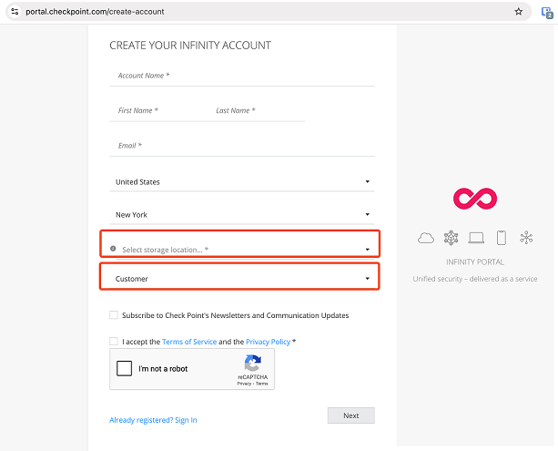
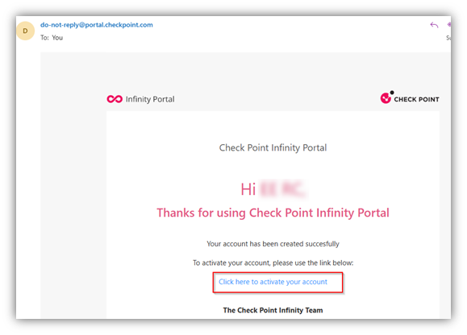
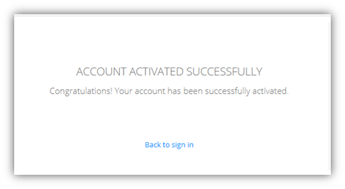
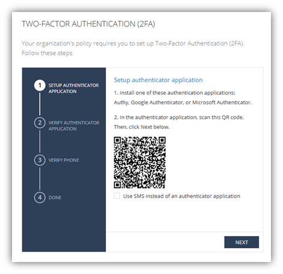
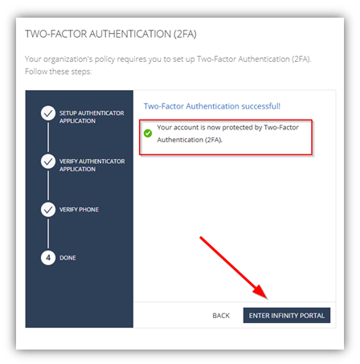
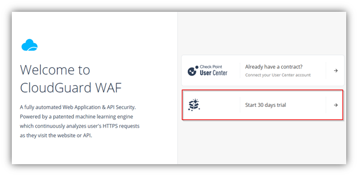
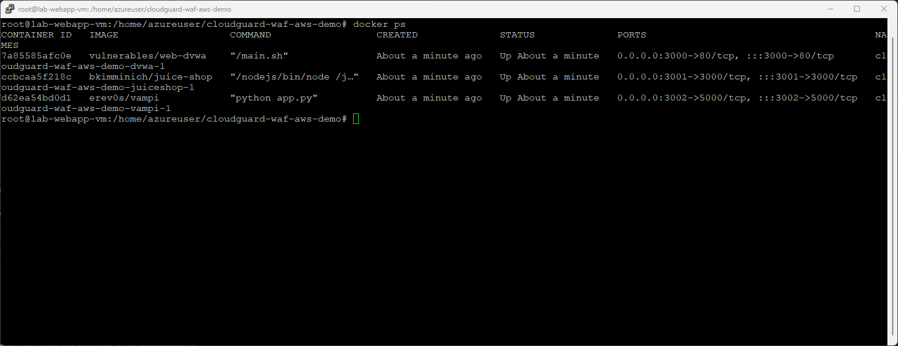

# M01 - CloudGuard WAF Lab Pre-requisites

## Overview

For this lab you will need the following:
- A laptop with a modern browser that supports HTML 5.0
- Admin access to your laptop to update the /etc/hosts file
- PuTTY or any other SSH client of your preference installed on your laptop
- Internet access
- Public cloud (Azure or AWS) lab credentials (provider by the trainer)

For the WAF SaaS lab you will need additionally:
- Access to a domain where you can create and edit CNAME, A and TXT records.
The WAF SaaS setup is cloud-based and needs a validated domain in order to setup service redirection and certificates.
AWS Route53 is a good and easily accessible service for doing this, but CloudFlare, Ionos or GoDaddy are good alternatives.
If you are in a Check Point organised workshop - your trainer will manage the DNS entries for you.

**Estimated time: 20 minutes**

In this exercise, you will:
1) Create a Check Point Infinity account and a trial WAF service tenant.
2) Create a set of publicly web application in Azure to protect by the WAF
3) Verify if the web applications are up and running

If you already have any of these requirements, you can skip the following instructions and start with the next module.

## Create a Check Point Infinity Portal Account
A Check Point Infinity Portal Account will be used for management and telemetry of CloudGuard WAF. If you don't have an account, take the following steps

### Task 1: Create an Infinity Portal tenant

- Go to https://portal.checkpoint.com and click > Don’t have an account? Register here.
- Fill in your details with a unique account name. Use DEMO- at the start of the account name following by your name.
- Select one of the main regions for data storage, not a local region. The main regions have the newest services available first, which may be required for the lab you are completing.
- Make sure to select 'Customer' as the account type.
	   


- Check your email to complete the account creation. Click the link in the email to activate your account, then set your password.



- Once that’s done, go ahead and log in. 



- Once you logged in, you will be redirected to the "Setup Two-Factor Authentication" page.



- Complete 2FA Setup steps and then click Enter Infinity Portal



### Task 2: Start a CloudGuard WAF Service Trial

- Go to https://portal.checkpoint.com and log in with the credentials you created in task 1. 
The name of the tenant should match with the account name you entered during creation of the portal tenant.
- Click on the menu in the top-left corner. From the dropdown, under CloudGuard, select WAF – Web Application & API Security.
- On the opened page, click Start 30 Days Trial.



You will be redirected to the CloudGuard WAF Dashboard.

## Create a set of public web applications in Azure

There are many ways to publicly host a web application. For this use case, we will create a Juiceshop and DVWA web application, and a vulnerble API called Vampi API hosted in Azure. If you don't have access to a cloud environment to publish a web application, ask your trainer to give you a link of a hosted web application to use during the lab.

### Task 1: Prepare Azure environmment networks

1. Go to Azure portal https://portal.azure.com/

2. In the Azure portal, select the Cloud Shell icon (top right). If necessary, configure the shell.
- Select PowerShell.
- Select No Storage Account required and your Subscription, then select Apply.
- Wait for the terminal to create and a prompt to be displayed.

3. On the toolbar of the Cloud Shell pane, select the Manage files icon, in the drop-down menu, select **Upload** and upload the following files azurenetworkingdeploy.json and azurenetworkingdeploy.parameters.json into the Cloud Shell home directory.

``Note: you can find the template files in the GitHub lab repository under (../assets/M01/)``

4. Deploy the following ARM templates to create the virtual network and subnets needed for this exercise. Make sure to update the resource group name to a resource group that exists within your lab (eg ODL-CSA-1939571-01)

```
$RGName = "ODL-CSA-1939571-01"
New-AzResourceGroupDeployment -ResourceGroupName $RGName -TemplateFile azurenetworkingdeploy.json -TemplateParameterFile azurenetworkingdeploy.parameters.json
```

### Task 2: Deploy Web App VM

1. On the Azure portal, open the PowerShell session within the Cloud Shell pane.

2. On the toolbar of the Cloud Shell pane, select the **Manage files** icon, in the drop-down menu, select **Upload** and upload the following files azurewebappdeploy.json and azurewebappdeploy.parameters.json into the Cloud Shell home directory one by one.

3. Deploy the following ARM templates to create the VMs needed for this exercise. Make sure to update the resource group name to a resource group that exists within your lab.

```
$RGName = "ODL-CSA-1939571-01"
New-AzResourceGroupDeployment -ResourceGroupName $RGName -TemplateFile azurewebappdeploy.json -TemplateParameterFile azurewebappdeploy.parameters.json
```

### Task 3: Deploy Web App in Docker on Web App VM

1. In the Azure portal, go to Virtual Machines

2. Select the VM named **lab-webapp-vm** and copy its public IP address

3. Open PuTTY on your laptop and configure the following:
- Host Name or IP address: azureuser@**YourVMIPAddress**
- Go to Connection > SSH > Auth > Credentials and Click **Browse...** in Private key file for authentication
- Select the private key and upload **webapp.pem** to your PuTTY configuration
- Go back to Session, provide a name (lab-webapp-vm) in **Saved Sessions** and click **Save**

4. Click Open in PuTTY to open your SSH session. Click **Accept** and PuTTY should successfully connect to the VM in Azure.

5. Execute the following commands one by one to install Docker:

```
sudo apt update
wget https://raw.githubusercontent.com/cadgo/vim/master/autoinstall.sh 
chmod +x autoinstall.sh
./autoinstall.sh -u ubuntu -d -n
```

6. After the installation process, execute the following commands one by one:

```
sudo usermod -aG docker $USER
docker ps -a
reboot
```

7. Reconnect to the Ubuntu and execute the current commands one by one.

```
git clone https://github.com/chkp-stuartgreen/cloudguard-waf-demo
```
8. Navigate to the folder using

```
cd cloudguard-waf-aws-demo/
```

9. Use Docker Compose to launch the containers. Run the following command:

```
docker compose up -d
```

Docker Compose will now begin pulling three containers. Once the images are downloaded, the containers will start automatically. The three containers (Juice Shop, DVWA, and Vampi API) are vulnerable web applications and an APIs designed for testing purposes.

10. After the installation process execute, check Docker containers by following command. Output should be like below. 

```
docker ps -a
```



Note: Under the Port column, you'll notice the listening ports and the forwarded ports mapped to Docker. For example, the DVWA app listens on port 80 inside the container. Docker maps the host's port 3000 to the container's port 80. This means when you access http://<host-ip>:3000, Docker forwards the request to the DVWA app running inside the container.

## Verify if the web applications are up and running

### Task 1: Prepare Azure environmment networks

1. Use the public IP address of the VM you copied from the previous section to browse to the following URLs:

- http://**YourVMIPAddress**:3000
- http://**YourVMIPAddress**:3001
- http://**YourVMIPAddress**:3002

If the websites show up in the browser they are up and running. If not, investigate if the Docker containers are running and if the VM is publicly available.