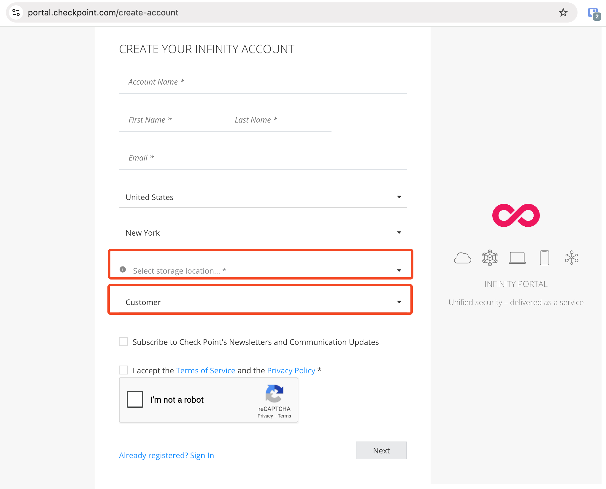
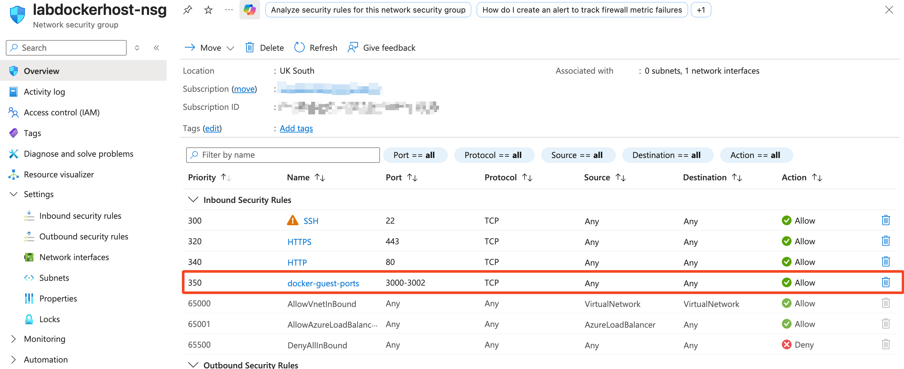
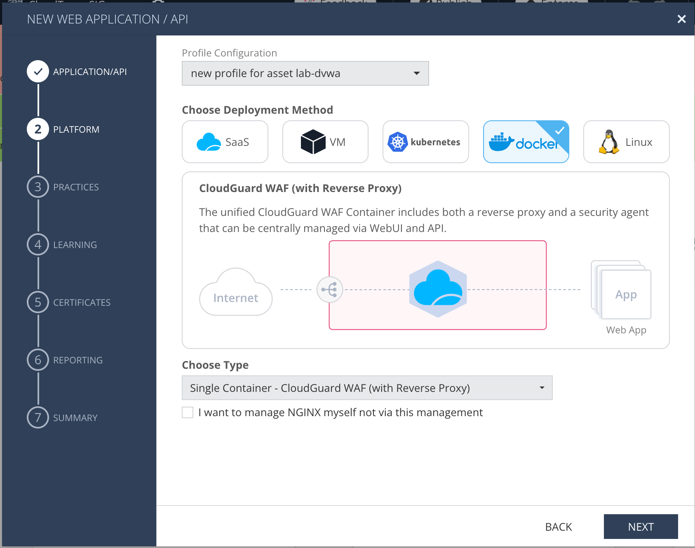
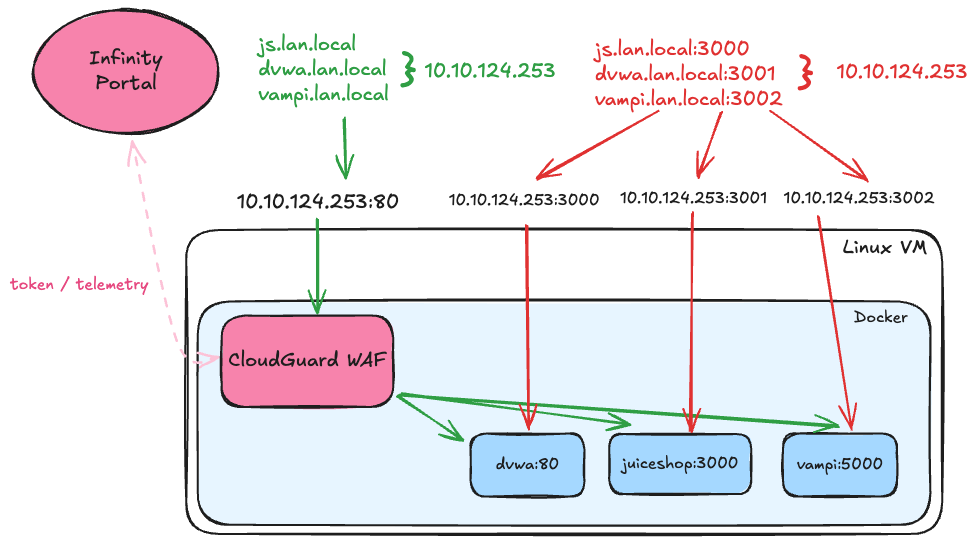

## CloudGuard WAF - Hands-on lab

#### Pre-requisites
**WAF SaaS and agent-based labs.
- Infinity Portal tenant. This will be used for management and telemetry.
	- Go to https://portal.checkpoint.com
	- Click 'register here' and fill in your details with a unique account name. Please use DEMO at the start of the account name.
	- Select one of the main regions for data storage, not a local region. The main regions have the newest services available first, which may be required for the lab you are completing.
	   Make sure to select 'Customer' as the account type.
	- 

**WAF SaaS lab
- Access to a domain where you can create and edit CNAME, A and TXT records.
	- The WAF SaaS setup is cloud-based and needs a validated domain in order to setup service redirection and certificates.
	- AWS Route53 is a good and easily accessible service for doing this, but CloudFlare, Ionos or GoDaddy are good alternatives.
	- If you are in a Check Point organised workshop - your trainer will manage the DNS entries for you.
- A VM / EC2 with a public IP.
	- AWS EC2, Azure VM, GCP VM - anything will be fine but the instructions in the lab guide will be for Azure. If you want to create this in the CSP of your choice that's fine, but you will need to be confident in setting this up. 
	- Docker needs to be installed and accessible on the VM to run a selection of vulnerable VMs.

**WAF Agent based lab
- Access to a domain where you can create and edit CNAME, A and TXT records.
	- The WAF SaaS setup is cloud-based and needs a validated domain in order to setup service redirection and certificates.
	- AWS Route53 is a good and easily accessible service for doing this, but CloudFlare, Ionos or GoDaddy are good alternatives.
	- If you are in a Check Point organised workshop - your trainer will manage the DNS entries for you.
	- **For agent based labs - we'll typically use the same infrastucture as the WAF SaaS lab - but because the domain doesn't need to be validated - you can get by with access to editing your hosts file. If you're using a restricted laptop or working environment, try to get access to a domain to avoid this workaround**
	- **For agent based labs - you also don't need a public IP but you do need internet access to connect to the Check Point Infinity Portal. You also need to be able to access the ports exposed via Docker to test your protected and unprotected web applications. Some enterprise security solutions will block this so to keep things simple, it is recommended to also run this in a cloud environment**

---

**Lab 1 - Agent based**

- Create an Ubuntu 24.04 VM
	- Public IP
		- If you are running this VM in a sandbox tenant with CGNS - make sure to place this in the frontend subnet to keep things simple - otherwise you will need to ensure you create firewall rules to accommodate the Docker host.
	- NSG with TCP/22 open (we'll amend this later to include more ports)
	- Go to the Azure portal and open up ports 3000-3002 in the NSG for the VM
	- 
	- check access to the public IP on ports 3000, 3001 and 3002
	- SSH in with the credentials / SSH key you set.
	- run `sudo apt update`
	- Follow instructions from here https://docs.docker.com/engine/install/ubuntu/
	- run `sudo usermod -aG docker $USER`
	- run `git clone https://github.com/chkp-stuartgreen/cloudguard-waf-demo`
- WAF Agent config - Infinity portal
	- Log in to your Infinity portal tenant and navigate to CloudGuard WAF
	- accept any terms and conditions for the demo period.
	- go to policy > create asset
	- name the asset lab-dvwa
	- the 'user will access the application' URL will be either http://dvwa.lan.local if you're setting it up with a host entry, or something you can setup on your publicly registered domain. This is the public facing entry point to be protected by WAF. 
		- If you are running in a Check Point led session, your instructor can setup public DNS for you.
	- The DNS for this should resolve to the VM public IP (or private IP if you are accessing it within the cloud vNet / VPC). Not the Docker IPs.
	- The last field is where the agent will access the upstream / origin. In this case -it will be http://dvwa
	- 
	- Setup your profile as above per the screenshot.
	- Set webapp and API to prevent mode. API discovery on disabled.
	- accept defaults on following screens and click Done to complete.
	- This should take you to the profile page. From here copy the authentication token and make sure to click 'Enforce' at the top of the window. Make a note of the profile name.
- VM final configuration
	- Back to the VMs SSH session (or restart if timed out) 
	- CD to the cloudguard demo directory
	- run `touch .env`
	- Edit the file with your favourite text editor and add the lines

		```bash
		COMPOSE_PROJECT_NAME=waf-demo
		token=cp-123-123-123-123-123-123-123
		```
		  
		  
	- run `docker compose up -d`
	- Now you should have a VM running with the following ports accessible (ignore the IPs - these might be different in your environment)
	- 
	- Ports 3000, 3001 and 3002 go directly to the vulnerable containers.
	- Port 80 will be protected by CloudGuard WAF.
	- If you go back to the infinity portal - you should see that an agent has successfully connected. This is our Docker container. If you want to inspect the container, you can execute the command 'cpnano -s' to get operational info.
	- Work through some of the vulnerabilities in the DVWA web application. Default login is admin and password. When first accessed, you will need to confirm setting up the database. Ignore any PHP errors.
- Configure additional assets
	- Back to the Infinity Portal and go to the assets page.
	- You will configure two new assets, juiceshop and Vampi
	- Go to Policy > Assets and follow the same procedure as before, but supplying a new name for each asset and a new local host or DNS name.
	- The upstream or origin configuration for the additional hosts is http://juiceshop:3000 and http://vampi:5000 . These hostnames won't be accessible from your linux host directly - but should be resolvable from the CloudGuard WAF container.
	- Set the protection to prevent and when you get to the deployment screen, select the docker standalone profile you created previously. You do not need to deploy a new agent or create a new profile here.
	- Click enforce when finished and you should now be able to access each application through its DNS hostname. 
	- Juice-shop has more challenging vulnerabilities to exploit and Vampi is an API only application. 
	- Before trying to exploit anything on Vampi, go to the relevant asset in the Infinity Portal and enable API discovery. Once enabled, enforce the policy and start browsing around the various paths documented at https://github.com/erev0s/VAmPI
	- **KEEP THIS VM - it's used for the next lab**

**Lab 2 - WAF SaaS**
- On the Linux VM
	- Keep the VM and container from the previous lab - but run `docker compose down` from the cloudguard-waf-demo directory.
	- Edit the docker-compose.yml file and comment out lines -18-22 to remove the cloudguard container from the stack. The other three containers should still be active. Save the file.
	- Run `docker compose up -d` to restart the vulnerable containers.
	- If you're not already using it, configure the public DNS entries for your VMs.
	- If you are running in a Check Point session - your trainer will set this up for you and provide you with a hostname.
- In the Infinity Portal
	- Create another new asset and follow the same process as before.
	- Configure a new asset in the same flow as before, but the URL will be the hostname you setup in public DNS and the upstream / origin will be your VM public IP. When you get to the deployment options screen - make sure to select **SaaS**.
	- Click through the following options accepting the defaults until you're taken to the profile page again.
	- You will see new options here around domain validation. You will need to follow these instructions to add the relevant CNAMEs or TXT records to your DNS. If you are in a Check Point led session - this will be done for you.
	- Once the domain is validated, wait until the wizard is completed - then check access.
	- The last step is to secure the origin by taking the IPs shown and editing the NSG attached to your VM so only those IPs can access it.
	- Test everything is working as expected and then try attacking the VM again. Your attacks should be unsuccessful. 
